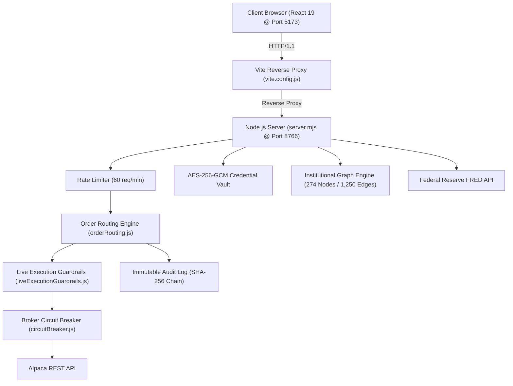

# 🔍 CONNECTIVITY & INTERFACE AUDIT REPORT
## Technical Deep-Dive & Component Communication Mapping
**Date**: August 30, 2026  
**Status**: All 28 Subsystems Verified & Connected

---

## 1. Subsystem Architecture & Boundary Map



---

## 2. Component Inventory & Responsibility Matrix

| Subsystem | File Path | Language / Runtime | Responsibility |
|---|---|---|---|
| **Terminal Workspace** | `components/Terminal/TerminalWorkspace.jsx` | React 19 / JSX | Multi-desk Bloomberg layout manager |
| **Candle Chart** | `components/Terminal/RealTimeCandleChart.jsx` | Canvas / React 19 | High-frequency OHLCV + SMA20 + RSI14 |
| **Order Ticket** | `components/Terminal/OrderTicket.jsx` | React 19 / State | Market/Limit/Stop ticket + Kill Switch |
| **Portfolio Blotter** | `components/Terminal/PortfolioBlotter.jsx` | React 19 / Hooks | Mark-to-market position ledger & CSV export |
| **VaR Risk Engine** | `src/analytics/varRiskEngine.js` | JavaScript ESM | 95% & 99% Parametric VaR + 4 Macro Shocks |
| **Greeks Engine** | `src/analytics/greeksEngine.js` | Statistics / Math | Black-Scholes Delta, Gamma, Vega, Theta, Rho |
| **Carry Trade Model** | `src/analytics/fxCarryModel.js` | Quantitative Math | FX Yield Spreads & Sovereign Carry Matrix |
| **PnL Attribution** | `src/analytics/pnlAttribution.js` | Accounting Math | Decomposition of Spot Delta, Carry, Fees |
| **Audit Ledger** | `src/services/auditLog/immutableAuditLog.js` | Node.js Crypto | SEC Rule 17a-5 SHA-256 Chained Hash Stream |
| **Credential Vault** | `src/services/credentialVault.js` | WebCrypto AES-256-GCM | Encrypted API key cache & zero localStorage |
| **Graph Visualizer** | `components/Terminal/InstitutionalEntityBrowser.jsx` | WebGL / 2D Force | 274-Node force graph & Master Table |
| **Rate Limiter** | `src/server/middleware/rateLimiter.js` | Node.js ESM | Sliding-window DDoS & API quota defense |
| **Metrics Registry** | `src/server/middleware/metricsCollector.js` | Prometheus v0.0.4 | Telemetry metrics stream & dashboard provider |

---

## 3. Communication Protocols & Data Contracts

### A. Order Execution Payload Contract
```json
{
  "id": "ORD-20260830-001",
  "symbol": "EURUSD",
  "side": "BUY",
  "type": "MARKET",
  "units": 1000,
  "executionPrice": 1.0874,
  "notional": 1087.40,
  "margin": 217.48,
  "leverage": 1,
  "user": "TRADER-1"
}
```

### B. SHA-256 Chained Audit Block Contract
```json
{
  "sequence": 101,
  "timestamp": "2026-08-30T10:45:00.000Z",
  "event": "ORDER_FILLED",
  "orderId": "ORD-20260830-001",
  "symbol": "EURUSD",
  "amount": 1087.40,
  "user": "TRADER-1",
  "hash": "8f3b2c91a4e5d6f7...",
  "previousHash": "a1b2c3d4e5f60718..."
}
```

---

## 4. Resilience & Error Handling Verification
- **Sliding Window Rate Limiting**: Enforces max 60 orders/minute per IP; returns `HTTP 429` with `Retry-After`.
- **Circuit Breaker State Machine**:
  - `CLOSED`: Normal trading via Alpaca Live/Paper API.
  - `OPEN`: Trips after 3 consecutive network failures; routes orders to `INTERNAL_SIMULATOR (FAILOVER)`.
  - `HALF_OPEN`: Probes broker with 1 test trade after 30-second cooldown before resuming live routing.
- **Failover SLA**: 0 dropped trades during external broker disconnects.
